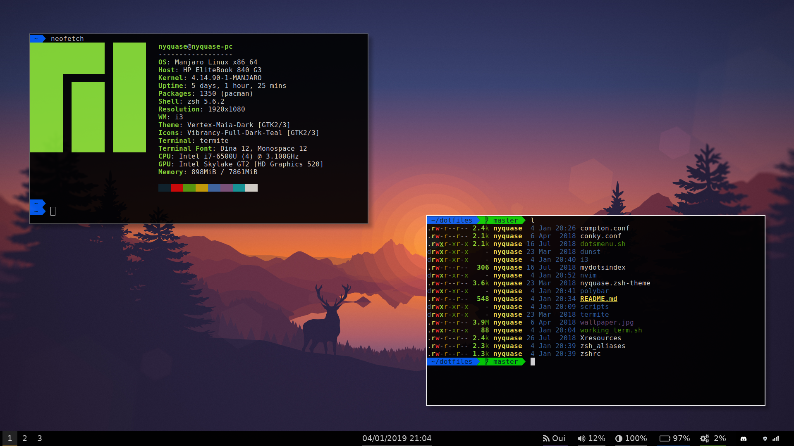

# Dotfiles

<p align="center">
  
</p>

This repository contains my personal configuration files and scripts.  
I'm using these on an **Ubuntu** 22.04 currently

Here is a non exhaustive list of the tools I use:

- **zsh** with:
  - **[oh-my-zsh](https://ohmyz.sh/)**
  - **[powerlevel10k](https://github.com/romkatv/powerlevel10k)**
  - **[zplug](https://github.com/zplug/zplug)**
  - **[vi-mode](https://github.com/Nyquase/vi-mode)**
  - and more
- **[neovim](https://neovim.io/)** with **[vim-plug](https://github.com/junegunn/vim-plug)**

- **[Helios theme](https://github.com/reyemxela/base16-helios-exported-themes)** for terminal

### Installation

You should be able to install this configuration by running

```sh
bash -c "$(wget -qO- https://raw.github.com/Nyquase/dotfiles/master/install.sh)"
```

Or

```sh
bash -c "$(curl -fsSL https://raw.github.com/Nyquase/dotfiles/master/install.sh)"
```

Or by cloning and running the script

```sh
git clone https://github.com/Nyquase/dotfiles.git ~/.dotfiles
cd ~/.dotfiles
./install.sh
```

Or just cherry-pick the files you want :)
