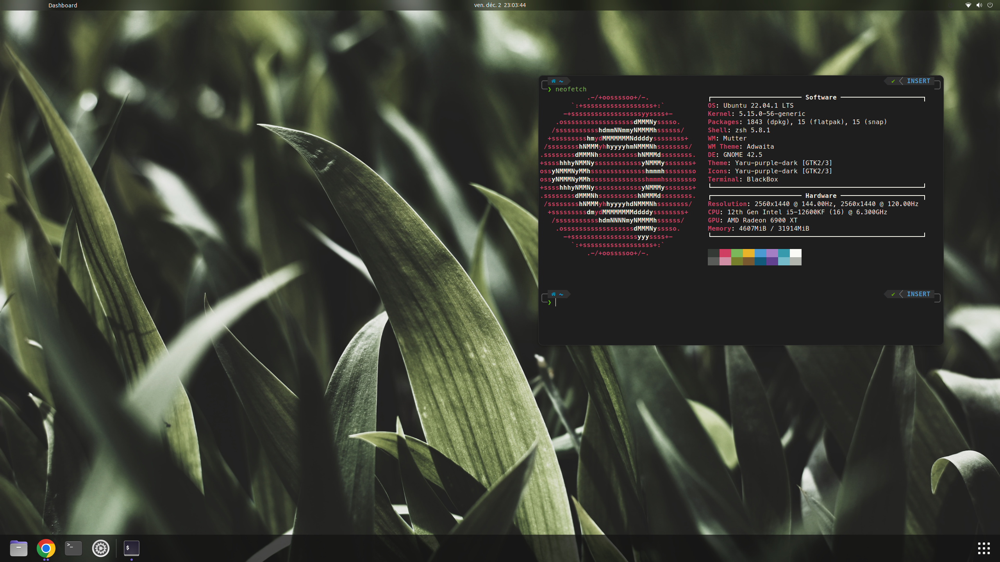

# Dotfiles


<p align="center">
  
</p>


This repository contains my personal configuration files and scripts.  
I use these on a **Manjaro** and an **Ubuntu**

Here is a non exhaustive list of the programs i use:
* **[i3](https://i3wm.org/)** with **[i3-gaps](https://github.com/Airblader/i3)**
* **[Polybar](https://github.com/jaagr/polybar)**
* **zsh** with **[oh-my-zsh](https://ohmyz.sh/)** and **[zplug](https://github.com/zplug/zplug)**
* **[neovim](https://neovim.io/)** with **[vim-plug](https://github.com/junegunn/vim-plug)**
* **[termite](https://github.com/thestinger/termite)**


### Installation
You should be able to install this configuration by running

```sh
bash -c "$(wget -qO- https://raw.github.com/Nyquase/dotfiles/master/dotfiles)"
```

Or

```sh
bash -c "$(curl -fsSL https://raw.github.com/Nyquase/dotfiles/master/dotfiles)"
```

Or by cloning and running the script
```sh
git clone https://github.com/Nyquase/dotfiles.git ~/.dotfiles && cd ~/.dotfiles
./dotfiles
```
